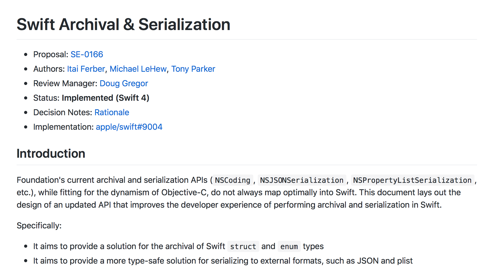
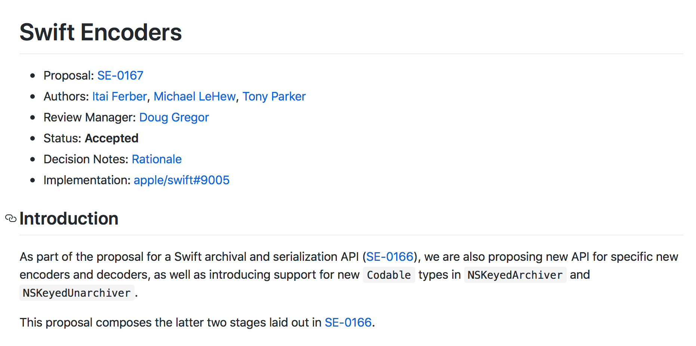

footer: Владимир Бурдуков для iOS-meetup SuperJob 30.11.2017 [](https://github.com/chipp) [](https://t.me/chippcheg) [](http://netcosports.com)
build-lists: true

# [fit] Decodable vs real-world JSON
### [fit] iOS-meetup SuperJob 30 ноября 2017
### Владимир Бурдуков [](https://github.com/chipp) [](https://t.me/chippcheg) [](http://netcosports.com)

[.footer: ]

---


[.footer: ]

^ делаем спортивные приложения. не для фитнеса, а для спортивных клубов, чемпионатов, федераций
^ Liverpool, PSG, TourDeFrance, Dakar, UERO
^ помогаем FIFA разрабатывать приложения для телекомпаний к WC 2018

---

# Порядок повествования

1. Как было раньше?
1. Как стало сейчас?
1. Где это применить?

---

# Наша песочница

```swift
struct Player {

  let firstName: String
  let lastName: String
  let displayName: String?
  let team: Team

}
```

^ модель которую будем наполнять

---

# Наша песочница

```json
{
  "first_name": "Cristiano Ronaldo",
  "last_name": "dos Santos Aveiro",
  "display_name": "Cristiano Ronaldo",
  "team": {"name": "Portugal"}
}
```

^ json, который будем декодировать

---

# Как было раньше
## Из коробки

```swift
struct Player {
  let firstName: String, lastName: String, displayName: String?, team: Team

  init(_ json: [String: Any]) throws {
    guard let firstName = json["first_name"] as? String else { throw ... }
    self.firstName = firstName

    guard let lastName = json["last_name"] as? String else { throw ... }
    self.lastName = lastName

    displayName = json["display_name"] as? String

    guard let teamJSON = json["team"] as? [String: Any] else { throw ... }
    team = try Team(teamJSON)
  }
}
```

---

# Как было раньше
## SwiftyJSON

```swift
struct Player {
  let firstName: String, lastName: String, displayName: String?, team: Team

  init(_ json: JSON) throws {
    guard let firstName = json["first_name"].string else { throw ... }
    self.firstName = firstName

    guard let lastName = json["last_name"].string else { throw ... }
    self.lastName = lastName

    displayName = json["display_name"].string

    team = try Team(json["team"])
  }
}
```

^ плюсы – никаких зависимостей. минусы – работа с вложенными словарями превращается в ад

---

# Как было раньше
## SwiftyJSON

```swift
struct Player {
  let firstName: String, lastName: String
  let displayName: String?, team: Team

  init(_ json: JSON) throws {
    self.firstName = json["first_name"].stringValue
    self.lastName = json["last_name"].stringValue
    displayName = json["display_name"].string
    team = try Team(json["team"])
  }
}
```

^ плюсы – простые методы для работы с optional значениями, удобная работа с вложенными структурами. минусы – монотонность

---

# Как было раньше
## Argo

```swift
struct Player {
  let firstName: String, lastName: String, displayName: String?, team: Team

  static func decode(_ json: JSON) -> Decoded<Player> {
    return curry(Player.init)
      <^> json <| "first_name"
      <*> json <| "last_name"
      <*> json <|? "display_name"
      <*> json <| "team"
  }
}
```

^ плюсы – декларативный синтаксис. минусы – пугающий синтаксис, проблемы при компиляции моделей с большим количеством полей

---

# Как было раньше
## Вставьте название своей любимой библиотеки

^ 3 года поисков решения проблемы породили множество библиотек
^ и ещё большее количество холиваров на эту тему

---

# Как стало сейчас

```swift
struct Player: Decodable {
  let firstName: String, lastName: String
  let displayName: String?, team: Team

  private enum CodingKeys: String, CodingKey {
    case firstName = "first_name"
    case lastName = "last_name"
    case displayName = "display_name", team
  }
}

let decoder = JSONDecoder()
let player = try decoder.decode(Player.self, from: data)
```

---



[.footer: ]

^ proposal #166, предлагает новые механизмы сериализации и десериализации сущностей в Swift
^ в особенности для структур и enum

---



[.footer: ]

^ proposal #167, предлагает реализацию Codable для JSON и Plist
^ реализует поддержку Codable для NSKeyedArchiver и NSKeyedUnarchiver

---

# Как стало cейчас

```swift
typealias Codable = Encodable & Decodable
```

^ рассмотрим только Decodable, Encodable отдельный новый мир

---

# Как стало cейчас

```swift
public protocol Decodable {
  init(from decoder: Decoder) throws
}
```

^ это единственный метод, который необходимо реализовать

---

# Как стало cейчас
## В чём польза?

```swift
struct Player: Decodable {
  let firstName: String, lastName: String
  let displayName: String?, team: Team

  private enum CodingKeys: String, CodingKey {
    case firstName = "first_name"
    case lastName = "last_name"
    case displayName = "display_name", team
  }
}
```

^ зачем нам ещё один механизм, который на первый взгляд не даёт ничего нового?

---

# Как стало cейчас
## В чём польза?

1. Для простых моделей генерируется код при компиляции

---

```swift
struct Player: Decodable {
  let firstName: String, lastName: String
}
```

^ исходная модель

---

```swift
struct Player: Decodable {
  let firstName: String, lastName: String
  @derived enum CodingKeys: String, CodingKey {
    case firstName, lastName
  }

  @derived init(from decoder: Decoder) throws {
    let container = decoder.container(keyedBy: CodingKeys.self)
    firstName = try container.decode(String.self, 
                                     forKey: .firstName)
    lastName = try container.decode(String.self, 
                                    forKey: .lastName)
  }
}
```

^ если хотим использовать ключи идентичные названиям свойств

---

```swift
struct Player: Decodable {
  let firstName: String, lastName: String
  enum CodingKeys: String, CodingKey {
    case firstName = "first_name", lastName = "last_name"
  }

  @derived init(from decoder: Decoder) throws {
    let container = decoder.container(keyedBy: CodingKeys.self)
    firstName = try container.decode(String.self, 
                                     forKey: .firstName)
    lastName = try container.decode(String.self, 
                                    forKey: .lastName)
  }
}
```

^ если хотим использовать другие названия ключей

---

# Как стало сейчас
## Что внутри?

---

# Как стало сейчас
## Decoder

```swift
public protocol Decoder {
  var codingPath: [CodingKey] { get }
  var userInfo: [CodingUserInfoKey : Any] { get }

  func container<Key>(keyedBy type: Key.Type) throws 
                      -> KeyedDecodingContainer<Key>
  func unkeyedContainer() throws -> UnkeyedDecodingContainer
  func singleValueContainer() throws -> SingleValueDecodingContainer
}
```

^ базовый протокол, передётся внутрь модели для парсинга
^ userInfo – мы можем передавать контекстную информацию в модель при парсинге
^ container(keyedBy: ) – аналог Dictionary
^ unkeyedContainer – аналог Array
^ singleValueContainer – для обработки единичных значений

---

# Как стало сейчас
## KeyedDecodingContainer

```swift
public struct KeyedDecodingContainer<Key: CodingKey> {
  var codingPath: [CodingKey]
  var allKeys: [Key]
  func contains(_ key: Key) -> Bool
  ...
}
```

^ контейнер с ключами – то есть Dictionary, где ключи это сущности дженерика Key
^ codingPath во всех контейнерах, обозначает все предыдущие ключи
^ все существующие ключи в этом контейнере
^ проверка на существование ключа

---

# Как стало сейчас
## KeyedDecodingContainer

```swift
public struct KeyedDecodingContainer<Key: CodingKey> {
  ...
  func decodeNil(forKey key: Key) throws -> Bool
  // decode Int, String, Bool, etc.
  func decode<T : Decodable>(_ type: T.Type, 
                             forKey key: Key) throws -> T 
  // decodeIfPresent Int, String, Bool, etc.
  func decodeIfPresent<T : Decodable>(_ type: T.Type, 
                                      forKey key: Key) throws -> T?
  ...
}
```

^ decodeNil – парсинг nil – есть в json null, то вернёт true
^ decode – парсинг конкретного типа по ключу – примитивы и всё, что поддерживает Decodable
^ decodeIfPresent – optional парсинг конкретного типа по ключу – то же самое

---

# Как стало сейчас
## KeyedDecodingContainer

```swift
public struct KeyedDecodingContainer<Key: CodingKey> {
  ...
  func nestedContainer<NestedKey>(keyedBy type: NestedKey.Type, 
                                  forKey key: Key) throws
                                  -> KeyedDecodingContainer<NestedKey>
  func nestedUnkeyedContainer(forKey key: Key) throws -> UnkeyedDecodingContainer
  func superDecoder() throws -> Decoder
  func superDecoder(forKey key: Key) throws -> Decoder
}
```

^ nestedContainer – получить вложенный контейнер, закодированный другим набором ключей
^ nestedUnkeyedContainer – получить вложенный массив
^ superDecoder - можем обернуть текущий контейнер в Decoder чтобы передать в другую модель, например

---

# Как стало сейчас
## UnkeyedDecodingContainer

```swift
public protocol UnkeyedDecodingContainer {
  var codingPath: [CodingKey] { get }
  var count: Int? { get }
  var isAtEnd: Bool { get }
  var currentIndex: Int { get }
}
```

^ контейнер без ключей – массив
^ codingPath - обсудили
^ count, isAtEnd, currentIndex – перебор массива

---

# Как стало сейчас
## UnkeyedDecodingContainer

```swift
public protocol UnkeyedDecodingContainer {
  ...
  mutating func decodeNil() throws -> Bool
  // decode Int, String, Bool, etc.
  mutating func decode<T : Decodable>(_ type: T.Type) throws -> T
  // decodeIfPresent Int, String, Bool, etc.
  mutating func decodeIfPresent<T : Decodable>(_ type: T.Type) throws -> T?
  ...
}
```

^ такие же методы, как в KeyedContainer
^ только они меняют состояние контейнера – увеличивают currentIndex

---

# Как стало сейчас
## UnkeyedDecodingContainer

```swift
public protocol UnkeyedDecodingContainer {
  ...
  mutating func nestedContainer<NestedKey>(keyedBy type: NestedKey.Type) throws
                                           -> KeyedDecodingContainer<NestedKey>
  mutating func nestedUnkeyedContainer() throws -> UnkeyedDecodingContainer
  mutating func superDecoder() throws -> Decoder
}
```

^ такие же методы, как в KeyedContainer

---

# Как стало сейчас
## SingleValueDecodingContainer

```swift
public protocol SingleValueDecodingContainer {
  var codingPath: [CodingKey] { get }
  func decodeNil() -> Bool
  func decode<T : Decodable>(_ type: T.Type) throws -> T
}
```

^ контейнер, хранящий примитивное значение – Int, String, Bool или Decodable

---

# Как стало сейчас
## Стандартные типы

- Int, Bool, String, Double ...
- Array, Set, Dictionary ...
- некоторые типы Foundation и CoreGraphics

---

# Как стало сейчас
## Реализации

1. JSONDecoder
1. PropertyListDecoder
1. NSKeyedUnarchiver (?)

^ поддержка десериализации в стандартной библиотеке Swift

---

# Как стало сейчас
## JSONDecoder

1. принимает на вход тип, реализующий Decodable, и Data
1. можно конфигурировать: 
  - как парсить Date
  - как парсить Data
  - как парсить Float
1. можно добавлять userInfo, который может использоваться как контекст внутри моделей

---

# Как стало сейчас
## JSONDecoder

```swift
let decoder = JSONDecoder()
decoder.dataDecodingStrategy = .base64
decoder.dateDecodingStrategy = .secondsSince1970
let player = try decoder.decode(Player.self, from: data)
```

---

# Где это применить?

^ парсинг простых JSONов – распарсить массив простых словарей
^ парсинг JSONов с вложенными структурами – например, у игрока есть структура команда
^ я применяю везде

---

# Где это применить?
## Пиар

Gnomon [](https://github.com/netcosports/Gnomon)

Astrolabe [](https://github.com/netcosports/Astrolabe)

^ две плохо документированные библиотеки
^ Gnomon с поддержкой Decodable – библиотека для составления запросов и получения моделей по результатам
^ Astrolabe – библиотека с DataSourcами для CollectionView и TableView. с поддержкой Gnomon

---

# Live Coding

Playground лежит на Github [](https://github.com/chipp/decodable-talk)
